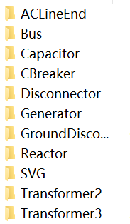

# README

## 文件夹解释

```
>log
	log.txt		--日志文件
>icon(已保存为压缩包)
	>ACLineEnd
	>xxx
>images				--本文件所用图片
>model(已保存为压缩包)
	icon_model		--不选择retrain时使用的model，可修改icon_classify使用别的model
	icon_model_test	--retrain后保存的model，可修改名称
	>angle_model		--角度模型文件夹
		各类别SVM模型
>sample
	里面的图片是直接从pdf中截取的，可以用来检测识别准确度，但是由于边框并未完全对其（估计结果不会很好），准确度还是参考val吧
>train
	里面的图片是用来训练的
>val
	里面的图片是用来验证的
data_process.ipynb	--处理icon成为train/val
icon.rar			--icon文件压缩包，直接解压至当前文件夹即可获得icon文件夹
icon_classify.py	--里面写了icon_classify类，可以调用它来识别类别
angle_classify.py	--里面写了angle_classify类，可以调用它来识别角度
main.py				--演示如何使用
model.rar			--model文件压缩包
README.md			--本文件
```

## 使用流程

- 解压icon.rar与model.rar，icon文件夹下生成如下文件夹



- 运行data_process.ipynb，生成train与val，比例大致为9：1，可以修改该val_rate
- 运行 main.py


应该一开始是没有model的，所以第一次必须retrain，之后保存模型的名字可以自己修改。

show_val可选，True则会使用val文件夹中图片进行验证

## 关于角度识别

```
INFO - ACLineEnd: 88/92=0.9565217391304348
INFO - Bus: 20/32=0.625
INFO - Capacitor: 12/16=0.75
INFO - CBreaker: 132/148=0.8918918918918919
INFO - Disconnector: 176/192=0.9166666666666666
INFO - Generator: 12/12=1.0
INFO - GroundDisconnector: 212/228=0.9298245614035088
INFO - Reactor: 4/4=1.0
INFO - Transformer2: 8/8=1.0
INFO - Transformer3: 8/8=1.0
INFO - Total result: 672/740=0.9081081081081082
```

当前angle_model下模型结果如下，Bus的角度分类结果低是由于所有图片拉伸为128*128后分类，因此无论旋转角度都是一片黑。

可以自行判断Bus角度（不需要SVM，横的是0°，竖的就是90°），只有两种结果（0°/90°）

除去Bus结果后，准确率为92.1%

另，因为只有四个SVG，不太好训练，不过**容易看出**SVG全部都是0°，所以也可以自行区分


ps：其实不太明白为啥它居然能分出来，因为好多图肉眼看0°和180°完全没有区别（因为本来就是对称的）

pps：用sample试了一下（全应该是0°），准确率80左右，也很奇怪。因为sample（pdf截图）里面好多图像本身就是对称的

